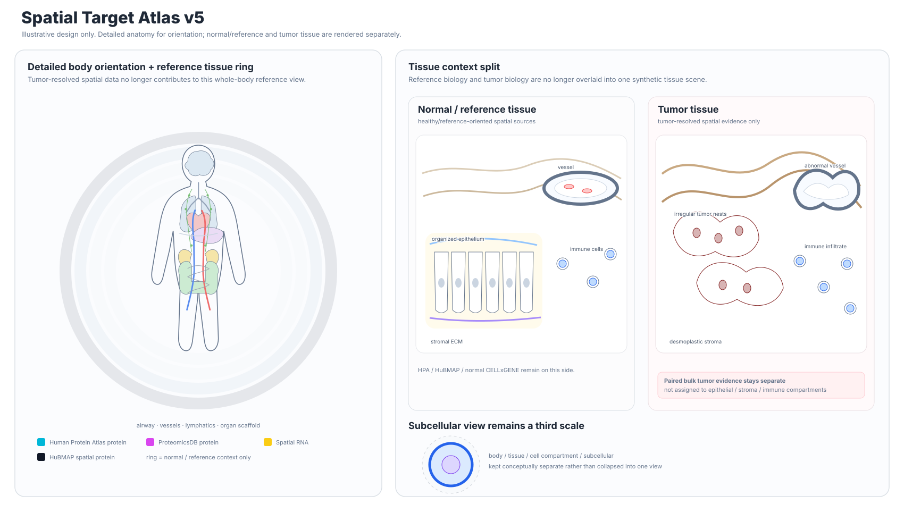
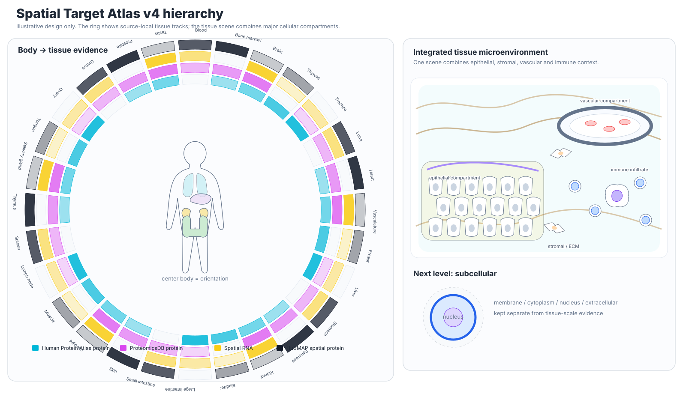

# Spatial overlay vignettes

These files are **visual design examples**, not scientific output from the LUAD build.

They are checked in so the spatial language can be reviewed directly in GitHub before relying on it for biological interpretation.

## Detailed anatomy + normal/tumor v5



This is the current primary direction. The center body has more anatomical detail and a visible airway/vascular/lymphatic scaffold. The tissue level is split into **Normal / reference tissue** and **Tumor tissue** instead of blending both contexts into one microenvironment. Tumor compartments are populated only from tumor-resolved spatial evidence; PDC paired proteomics stays a separate bulk annotation.

## Radial body + integrated tissue v4



This is the current primary visual direction. The body is an orientation anchor, while a fixed radial tissue ring carries the detailed source tracks. The next level down is one integrated epithelial/stromal/vascular/immune tissue scene rather than separate cell cards.

## Cell-context redesign


The cell section now uses tissue microenvironment scenes rather than isolated cartoon cell icons:

- epithelial sheet with lumen and basement membrane
- endothelial vessel with vascular lumen
- fibroblast/stromal field with collagen-rich ECM
- mixed immune field with lymphocyte and macrophage-like morphologies

Source signal is drawn as translucent context overlays or outlines behind/around the biological structures. The cells themselves stay mostly neutral so morphology remains readable.

## v2 source-opacity redesign


This is the current visual direction: better anatomy masks, true transparent source layers, source-separated small multiples, tissue microenvironment scenes, and a subcellular cell schematic. Current views use full source names rather than channel acronyms.

## Original v0.6 concept


The original v0.6 concept used channel letters. Those labels are retained here only as historical design context; current atlas views use plain-English source names and color overlays without exposing the internal channel keys.

Gray means no positive channel is shown in the design example. In generated reports, unavailable or failed sources remain explicitly `unknown`; they are not converted to negatives.

## Legacy early HTML prototype

[luad_overlay_vignette.html](luad_overlay_vignette.html) is retained as an early layout prototype. Use the v2 body overlay and v3 cell-context SVGs above for current visual review. The legacy HTML includes:

- body-level source overlays
- organ evidence cards
- early cell-context bubbles
- subcellular localization
- PDC tumor-versus-adjacent badges
- within-dataset intensity bars

The intensity bars are scaled only within each dataset. They are not cross-dataset or cross-modality scores.

Once a real atlas build exists, use:

```bash
spatial-target-atlas build-overlay \
  --core outputs/luad \
  --hubmap-cells outputs/luad-hubmap-cells \
  --spatial-census outputs/luad-census-spatial \
  -o outputs/luad-overlay.json

spatial-target-atlas render-atlas \
  --core outputs/luad \
  --hubmap-cells outputs/luad-hubmap-cells \
  --spatial-census outputs/luad-census-spatial \
  -o outputs/luad-atlas.html
```
