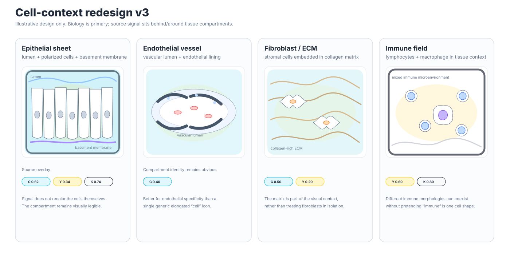
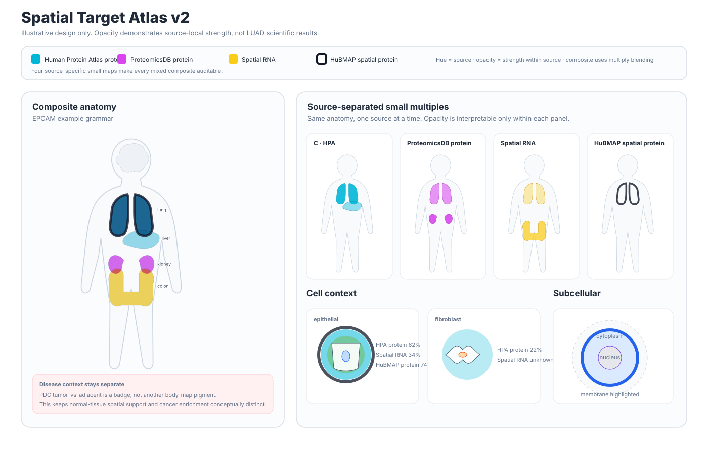
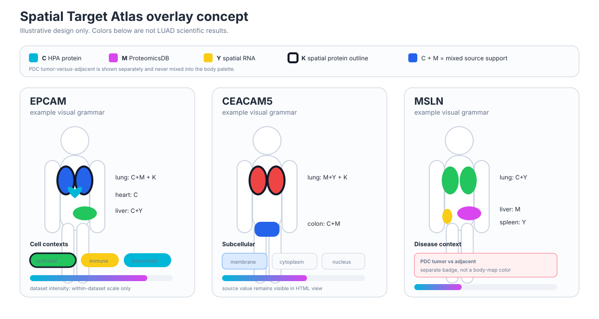

# Spatial overlay vignettes

These files are **visual design examples**, not scientific output from the LUAD build.

They are checked in so the spatial language can be reviewed directly in GitHub before relying on it for biological interpretation.

## Cell-context redesign



The cell section now uses tissue microenvironment scenes rather than isolated cartoon cell icons:

- epithelial sheet with lumen and basement membrane
- endothelial vessel with vascular lumen
- fibroblast/stromal field with collagen-rich ECM
- mixed immune field with lymphocyte and macrophage-like morphologies

Source signal is drawn as translucent context overlays or outlines behind/around the biological structures. The cells themselves stay mostly neutral so morphology remains readable.

## v2 source-opacity redesign



This is the current visual direction: better anatomy masks, true transparent source layers, source-separated small multiples, cell-type icons, and a subcellular cell schematic.

## Original v0.6 concept



The visual grammar is:

- **C**: HPA tissue protein support
- **M**: ProteomicsDB tissue protein support
- **Y**: spatial RNA positivity
- **K**: HuBMAP spatial protein support, rendered as a dark outline

C/M/Y colors mix categorically. K remains an outline so it does not erase the other source combination.

Gray means no positive channel is shown in the design example. In generated reports, unavailable or failed sources remain explicitly `unknown`; they are not converted to negatives.

## Dataset-resolved view

Open [luad_overlay_vignette.html](luad_overlay_vignette.html) locally to review the fuller layout with:

- body-level source overlays
- organ evidence cards
- cell-context bubbles
- subcellular localization
- PDC tumor-versus-adjacent badges
- within-dataset intensity bars

The intensity bars are scaled only within each dataset. They are not cross-dataset or cross-modality scores.

Once a real atlas build exists, use:

```bash
spatial-target-atlas build-overlay \
  --core outputs/luad \
  --hubmap-cells outputs/luad-hubmap-cells \
  --spatial-census outputs/luad-census-spatial \
  -o outputs/luad-overlay.json

spatial-target-atlas render-atlas \
  --core outputs/luad \
  --hubmap-cells outputs/luad-hubmap-cells \
  --spatial-census outputs/luad-census-spatial \
  -o outputs/luad-atlas.html
```
